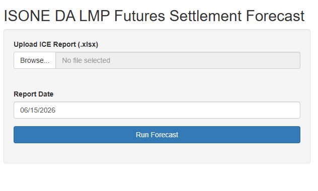
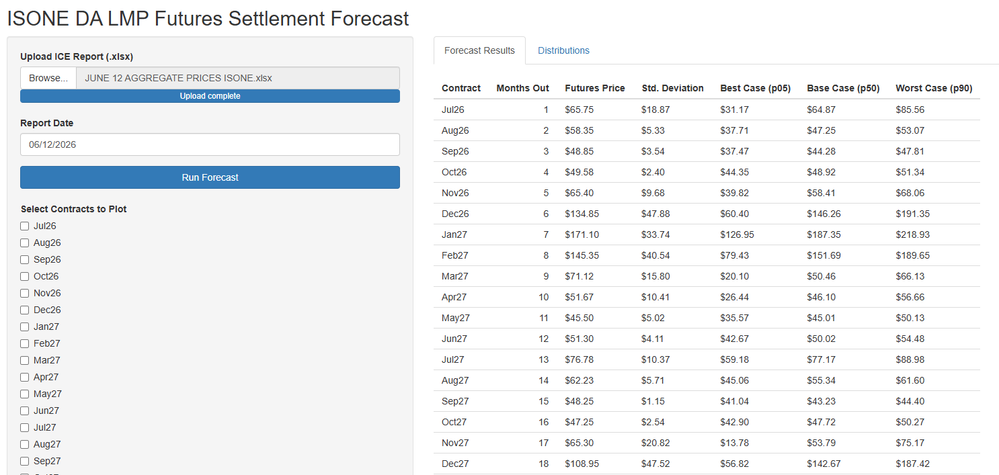
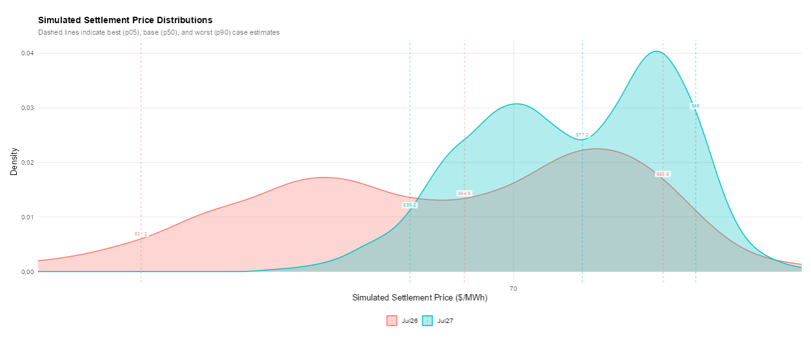
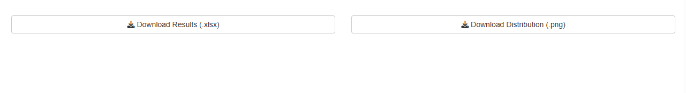
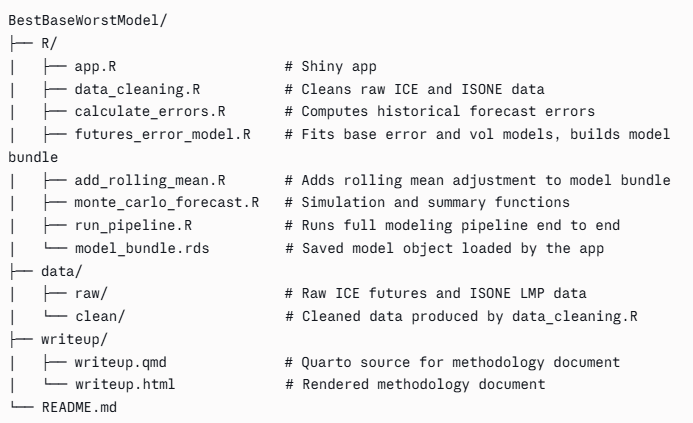

# BestBaseWorstModel

## Overview

This project is intended to predict the price distribution of ISO-New England (ISONE) average monthly Day-Ahead Locational Marginal Pricing (DA LMP). There are two primary components:

1\. A Shiny App for uploading daily ICE futures reports and examining the resulting DA-LMP settlement distribution for each contract

2\. A stastistical model that functions as the engine of the project, combining linear regression, a Gamma GLM, and Monte Carlo simulation to produce predictive price distributions.

The app is designed for users who do not have to interact with the model directly, but its components and statistical underpinnings are described in the full methodology write-up lined below:

[Full Writeup](https://nategarozzo.github.io/BestBaseWorstModel/writeup/writeup.html)

## App

The app takes in an ICE daily futures report and outputs both a table and visualization displaying the price settlement distribution for the contracts listed. To access the app, use [this link](https://nategarozzo.shinyapps.io/isone-lmp-forecast/), which takes you to an R Shiny application hosted on shinyapps.io. To make a forecast, upload an excel sheet of the daily ICE report. The sheet must have columns "CONTRACT MONTH" and "PRICE".

{width="500"}

After uploading and hitting "Run Forecast", a table detailing the price distributions for each contract appears:

Users may also inspect the distributions visually:

{width="685" height="347"}

If you would like to download either the table as an excel sheet or an image of the distribution, you can do so by clicking near the bottom of the page:

{width="688" height="92"}

**Note: App forecasts are capped at 30 months (2.5 years) out, due to lack of forecasting reliability past this point.**

## File Structure

Below is a summary of the structure of this repository. All coding components (including the app) live in `/R`, all data (raw and cleaned) lives in `/data`, and the write-up .qmd/.html live in `/writeup`.

## Data

The model is trained on two primary data sources:

1.  **ISONE settled monthly average DA LMPs from 2013-2026**
2.  **ICE ISONE DA daily peak and off-peak fixed price futures from 2022-2026**

To update the model with new data, add the latest settled LMP values to `data/raw/isone_settled_avg_da_lmp_2013_2026.csv`, the and the latest ICE report data to `data/raw/off_peak_isone_historical_futures_2022_2026.csv` and `peak_isone_historical_futures_2022_2026.csv`. Then rerun `R/run_pipeline.R`.

## Requirements

- `tidyverse` - Data wrangling and visualization

- `lubridate` - Parsing dates

- `readxl` - Reading ICE reports

- `writexl` - Exporting forecast results

- `shiny` - Web app framework

- `splines` - Natural cubic spline transformations, used for fitting the model

- `scales` - Formatting diagnostic outputs

- `patchwork` - Combining ggplot visualizations

- `knitr` - Clean table renderings
